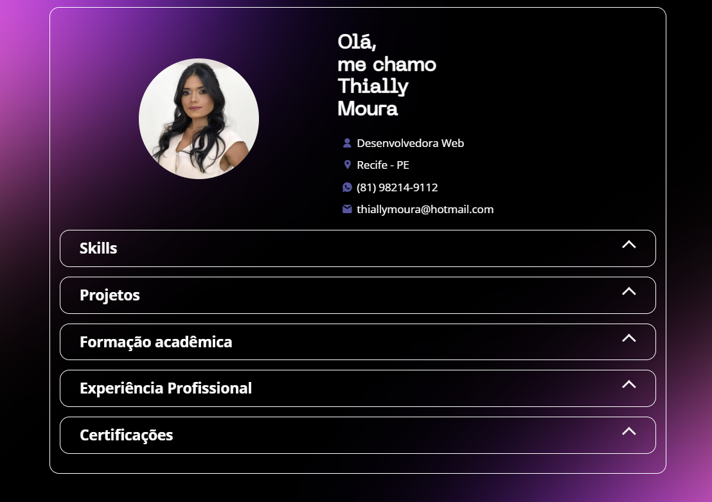

<h1> 🌟 Portfolio - Projeto Conclusão 🚀 </h1>

  

## Sobre o Projeto 💼

Este projeto foi desenvolvido como parte da conclusão do curso JavaScript Developer pela DIO. Durante a formação, aprendi desde os fundamentos da programação até conceitos avançados. O objetivo principal foi criar um portfólio interativo e profissional, exibindo minha trajetória, habilidades, projetos, certificações e experiências.

O portfólio oferece uma navegação intuitiva, com interatividade e animações que proporcionam uma experiência fluida e envolvente.

## Tecnologias Utilizadas 🛠️

- HTML e CSS: Para a estrutura e o design do portfólio. 🎨
- JavaScript: Para funcionalidades dinâmicas e interatividade. ✨
- Git e GitHub: Para controle de versão e hospedagem do projeto. 🗂️
- APIs: Para integração de dados e funcionalidades adicionais. 🔗

## Funcionalidades Principais ✨

- Sobre Mim: Uma introdução pessoal que destaca minha transição de carreira, trajetória e objetivos profissionais.
- Habilidades (Skills): Lista das tecnologias e ferramentas que domino, incluindo HTML, CSS, JavaScript e Git.
- Projetos: Galeria interativa apresentando projetos com links para repositórios ou demonstrações ao vivo.
- Formação Acadêmica: Detalhamento da minha graduação e outros cursos relevantes, incluindo a formação em JavaScript Developer pela DIO.
- Experiência Profissional: Breve resumo das minhas experiências anteriores na área de arquitetura e sua relação com a tecnologia.
- Certificações: Certificados obtidos durante os cursos, workshops e bootcamps realizados.

## Design Responsivo 📱💻

O portfólio foi desenvolvido para se adaptar a qualquer dispositivo, garantindo uma ótima experiência tanto em desktops quanto em tablets e celulares.
